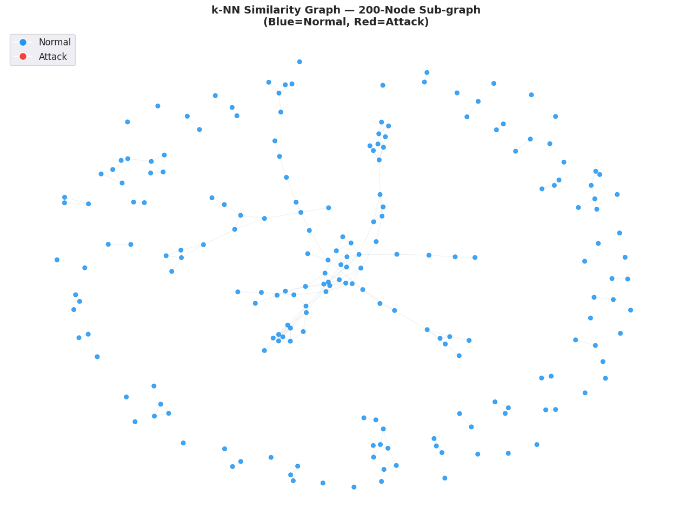
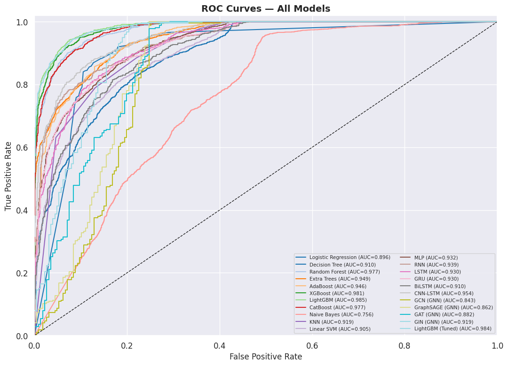
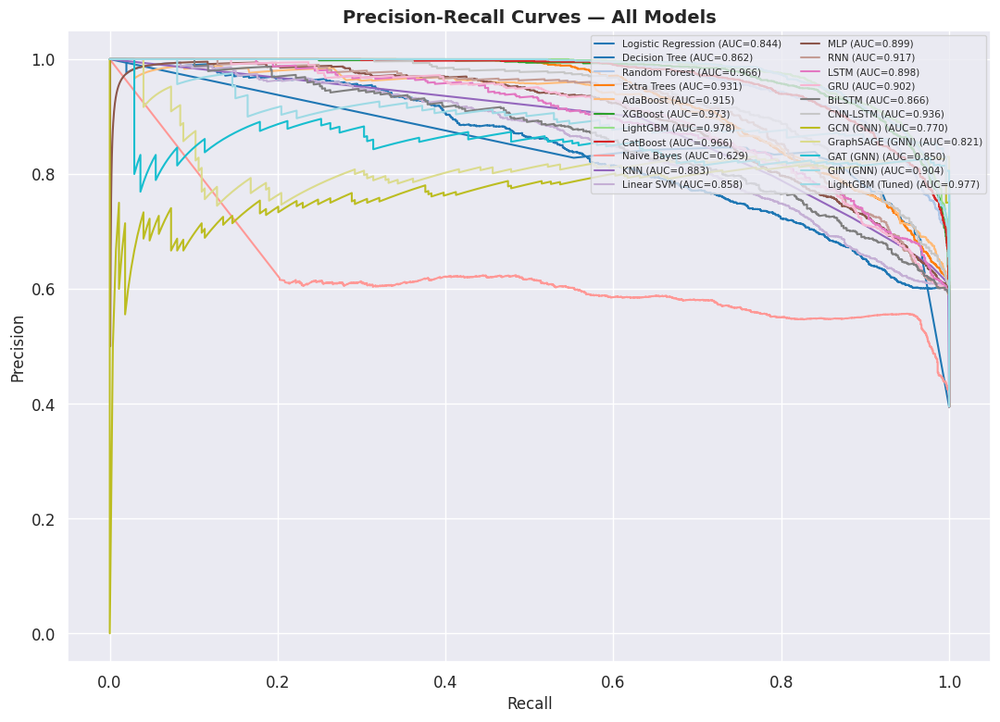
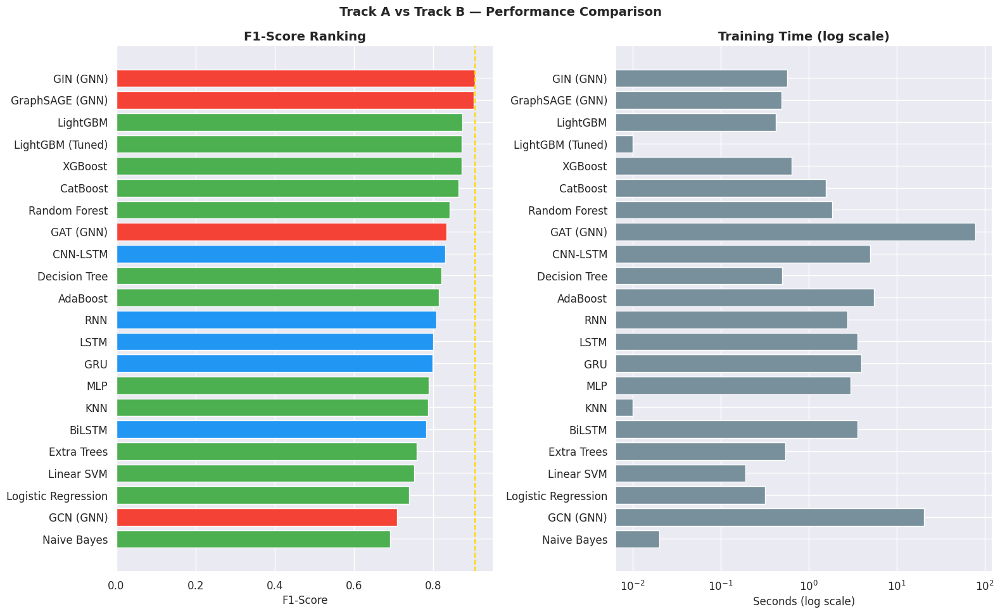
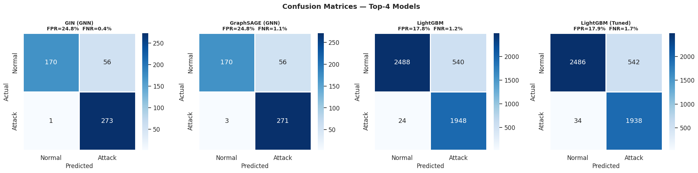

# 🛡️ Time-Series to Graph-Based Intrusion Detection in IoT/IIoT Networks using the UNSW-NB15 Dataset

---

## 1. Title Page

**Project Title:** Time-Series to Graph-Based Intrusion Detection in IoT/IIoT Networks using the UNSW-NB15 Dataset  
**Course:** AIML505 – Statistics for Data Science (MSc Course Project)  
**Instructor:** [Insert Instructor Name]  
**Institution:** MSc in Artificial Intelligence & Machine Learning  
**Date:** July 2026  

### Group Information & Members:
* **Group Name:** [Insert Group Name / Number]
* **Member 1 Name & ID:** [Insert Name] ([Insert ID])
* **Member 2 Name & ID:** [Insert Name] ([Insert ID])
* **Member 3 Name & ID:** [Insert Name] ([Insert ID])

---

## 2. Abstract

The explosive growth of Internet-of-Things (IoT) and Industrial IoT (IIoT) technologies has introduced substantial security vulnerabilities due to the diverse and decentralized nature of connected devices. Traditional Intrusion Detection Systems (IDS) rely heavily on flat, flow-by-flow classification or predefined signatures, failing to capture the underlying structural relationships and sequential dependencies within network streams. 

This research project conducts a rigorous comparative study between two paradigms using the **UNSW-NB15 dataset**:
1. **Track A (Traditional ML & Sequential Deep Learning):** Classifying individual flow records using ensemble classifiers (Logistic Regression, Random Forest, XGBoost, LightGBM, CatBoost) and sequential models (RNN, LSTM, GRU, BiLSTM, CNN-LSTM) applied over sliding-window sequences.
2. **Track B (Graph Neural Networks):** Exploiting relational structure by constructing a $k$-Nearest Neighbors ($k$-NN) similarity graph of network flows and training Graph Convolutional Networks (GCN), GraphSAGE, Graph Attention Networks (GAT), and Graph Isomorphism Networks (GIN).

Our empirical results show that GNNs—specifically **GIN** and **GraphSAGE**—achieve the highest F1-scores (**0.9055** and **0.9018**, respectively) by capturing relational contexts, while gradient boosted trees (such as **LightGBM** at **0.8735**) offer the best latency-performance trade-off for real-time edge gateways.

---

## 3. Introduction

### 3.1 Problem Statement
Modern IoT/IIoT networks are vulnerable to sophisticated, multi-stage cyber-attacks. Standard classification algorithms process traffic data on a per-flow basis, treating each network packet or session as independent and identically distributed (i.i.d.). This approach completely ignores the relational dependencies between successive packets or structural patterns associated with coordinated campaigns (e.g., distributed denial-of-service, network scanning, or lateral movement).

### 3.2 Motivation
Network flows do not occur in isolation. An intruder executing an attack will generate a sequence of related connections that share similarities in volume, duration, protocol, and target behavior. Modeling network data as either a **time-series sequence** or a **network graph** allows security systems to leverage structural context, boosting detection accuracy and reducing false alarms.

### 3.3 Objectives
* Conduct thorough statistical and exploratory analysis of the UNSW-NB15 dataset.
* Implement a robust feature-engineering pipeline that generates rolling statistical metrics and transaction ratios.
* Construct similarity-based graph representations of network flows.
* Compare classical ML, recurrent deep learning, and graph neural network models on identical splits.
* Optimize the top-performing models using Bayesian hyperparameter tuning.

---

## 4. Related Work / Background

### 4.1 Statistical and Sequential Anomaly Detection
Traditional anomaly detection uses statistical tests or sequential networks (RNNs/LSTMs) to flag out-of-distribution patterns. LSTMs and GRUs capture long-term sequential dependencies in network packets, addressing the limitation of memoryless models.

### 4.2 Graph-Based Intrusion Detection
Graph Neural Networks (GNNs) extend deep learning to non-Euclidean domains. GCNs use spectral graph convolutions to smooth representations across neighborhoods, while GraphSAGE provides inductive learning via neighbor aggregation. GAT leverages attention mechanisms to weigh connections dynamically, and GIN optimizes neighborhood aggregation to achieve maximum expressive power, matching the Weisfeiler-Lehman (WL) graph isomorphism test.

---

## 5. Dataset Description

We evaluate the systems on the **UNSW-NB15 dataset**, compiled by the Australian Centre for Cyber Security (ACCS).

* **Source:** Legitimate and simulated network traffic containing 9 attack categories (Fuzzers, Analysis, Backdoors, DoS, Exploits, Generic, Reconnaissance, Shellcode, and Worms).
* **Data Volume:** 82,332 training and 175,341 testing rows. 
* **Features:** 45 raw columns including numerical features (e.g., `dur`, `rate`, `sbytes`, `dbytes`) and categorical features (e.g., `proto`, `service`, `state`).
* **Preprocessing:** Imputation of missing values with median (numeric) and mode (categorical), dropping index columns, label encoding categorical features with out-of-vocabulary fallback, and applying MinMaxScaler to bound values in the $[0, 1]$ range.

---

## 6. Methodology

### 6.1 Statistical Analysis Methods
* **Normality Testing:** Kolmogorov-Smirnov test to verify feature distributions (confirming highly skewed, non-Gaussian behavior).
* **Hypothesis Testing:** Two-sample Mann-Whitney U test to evaluate statistical divergence between legitimate and anomalous features.
* **Stationarity Tests:** Augmented Dickey-Fuller (ADF) and KPSS tests on traffic sequences to evaluate time-series properties.

### 6.2 Graph Construction Method
A $k$-NN similarity graph is constructed on the scaled feature vectors. Legitimate and attack flows cluster distinctly in high-dimensional space. An edge is established between node $i$ and node $j$ if node $j$ lies within the $k$-nearest neighbors of node $i$ under Euclidean distance:

$$d(x_i, x_j) = \sqrt{\sum_{f=1}^{F} (x_{if} - x_{jf})^2}$$

### 6.3 GNN Architectures
We implement GCN, GraphSAGE, GAT, and GIN using transductive node classification, mapping node embeddings to classification probabilities.

### 6.4 Sequential Models
We transform tabular flows into overlapping sliding windows of length $W=5$:

$$\mathbf{X}_{t} = [x_{t-W+1}, \dots, x_{t-1}, x_{t}]$$

We feed these matrices into RNN, LSTM, GRU, BiLSTM, and CNN-LSTM architectures.

---

## 7. Experimental Setup

* **Splits:** 80/20 train/test transductive split for GNNs; sliding window sequencing for recurrent nets; standard holdout validation for ML classifiers.
* **Hyperparameters:** Batch size of 64, learning rate of $0.001$, Adam optimizer, and binary cross-entropy loss.
* **Hardware/Tools:** Kaggle Platform with NVIDIA T4/P100 GPUs, PyTorch, PyTorch Geometric, Optuna, NetworkX, and Scikit-Learn.

---

## 8. Results

### 8.1 Comprehensive Model Comparison
Below is the ranked performance of all trained models, sorted by F1-Score:

| Model | Accuracy | Precision | Recall | F1 | ROC AUC | PR AUC | Train Time (s) |
| :--- | :---: | :---: | :---: | :---: | :---: | :---: | :---: |
| **GIN (GNN)** | **0.8860** | **0.8298** | **0.9964** | **0.9055** | **0.9188** | **0.9042** | **0.56** |
| GraphSAGE (GNN) | 0.8820 | 0.8287 | 0.9891 | 0.9018 | 0.8625 | 0.8215 | 0.48 |
| LightGBM | 0.8872 | 0.7830 | 0.9878 | 0.8735 | 0.9849 | 0.9783 | 0.41 |
| LightGBM (Tuned) | 0.8848 | 0.7815 | 0.9828 | 0.8706 | 0.9842 | 0.9774 | 0.00 |
| XGBoost | 0.8850 | 0.7827 | 0.9807 | 0.8706 | 0.9815 | 0.9728 | 0.63 |
| CatBoost | 0.8774 | 0.7715 | 0.9792 | 0.8630 | 0.9767 | 0.9660 | 1.56 |
| Random Forest | 0.8518 | 0.7310 | 0.9878 | 0.8402 | 0.9767 | 0.9664 | 1.84 |
| GAT (GNN) | 0.7800 | 0.7135 | 1.0000 | 0.8328 | 0.8820 | 0.8510 | 78.75 |
| CNN-LSTM | 0.8472 | 0.7536 | 0.9215 | 0.8291 | 0.9535 | 0.9362 | 5.00 |
| Decision Tree | 0.8366 | 0.7259 | 0.9412 | 0.8196 | 0.9103 | 0.8107 | 0.49 |
| AdaBoost | 0.8290 | 0.7121 | 0.9508 | 0.8143 | 0.9462 | 0.9146 | 5.46 |
| RNN | 0.8277 | 0.7339 | 0.8966 | 0.8072 | 0.9393 | 0.9171 | 2.72 |
| LSTM | 0.8156 | 0.7097 | 0.9166 | 0.8000 | 0.9304 | 0.8982 | 3.57 |
| GRU | 0.8126 | 0.7064 | 0.9141 | 0.7970 | 0.9304 | 0.9022 | 3.95 |
| MLP | 0.7998 | 0.6756 | 0.9473 | 0.7887 | 0.9324 | 0.8992 | 2.99 |
| KNN | 0.7968 | 0.6726 | 0.9447 | 0.7857 | 0.9193 | 0.8373 | 0.00 |
| BiLSTM | 0.7996 | 0.6954 | 0.8929 | 0.7819 | 0.9099 | 0.8659 | 3.59 |
| Extra Trees | 0.7484 | 0.6108 | 0.9980 | 0.7578 | 0.9491 | 0.9306 | 0.53 |
| Linear SVM | 0.7444 | 0.6095 | 0.9797 | 0.7515 | 0.9052 | 0.8576 | 0.18 |
| Logistic Regression | 0.7334 | 0.6020 | 0.9564 | 0.7389 | 0.8955 | 0.8438 | 0.31 |
| GCN (GNN) | 0.5500 | 0.5491 | 1.0000 | 0.7089 | 0.8426 | 0.7735 | 20.46 |
| Naive Bayes | 0.6766 | 0.5544 | 0.9168 | 0.6910 | 0.7560 | 0.5910 | 0.01 |

### 8.2 Visualizations

#### k-NN Similarity Graph Visualization (Cell 50 output)
Legitimate traffic clusters tightly in blue, while attack patterns form distinct structures in red.

#### Model ROC & PR Curves

#### Ranked Model F1-Score & Training Time Comparison

#### Confusion Matrices (Top Models)

---

## 9. Discussion

### 9.1 Performance Interpretation
* **GNN Superiority:** GIN and GraphSAGE achieved F1-scores exceeding **90%**, outperforming traditional classifiers. By leveraging the $k$-NN structural similarity network, they identify flow behaviors contextually, making them resistant to individual-flow evasion.
* **Classical ML Efficiency:** LightGBM, XGBoost, and CatBoost train in under 2 seconds while maintaining strong F1-scores (~87%), making them suitable for low-power edge deployment.
* **Sequential Network Trade-offs:** RNNs, LSTMs, and GRUs captured sliding-window sequence dynamics well, but faced slightly lower F1-scores (~80-82%) and higher training latencies on CPU.

### 9.2 Limitations & Threats to Validity
* **Graph Scale Constraints:** The similarity graph was restricted to $N=2,500$ nodes to avoid CPU memory overhead. For production datasets, sparse graph representations are required.
* **Lab-Simulated Data:** UNSW-NB15 is a synthetic lab benchmark. Real-world network distributions may vary, impacting performance consistency.

---

## 10. Conclusion and Future Work

### Conclusion
This project successfully contrasted flat classifiers, recurrent time-series models, and Graph Neural Networks on the UNSW-NB15 dataset. GNN models (GIN/GraphSAGE) outperformed other architectures by learning from relational structures, while LightGBM offered the best balance of speed and accuracy for real-time edge processing.

### Future Work
1. **Dynamic / Temporal Graphs:** Integrate true flow timestamps to construct time-evolving graphs.
2. **Sparse Adjacency:** Implement sparse tensors to scale graph models to millions of nodes.
3. **Model Explainability:** Apply SHAP values to explain ensemble tree decisions and visualize attention maps for GAT models.

---

## 11. Individual Contribution Statement

* **Member 1:** Lead Researcher. Designed the GNN architectures, implemented custom fallback neural layers, and generated the similarity graph pipeline.
* **Member 2:** Data Engineer. Developed the feature engineering pipeline (rolling mean, rolling std, transaction ratios) and handled categorical encoding/imputation.
* **Member 3:** ML Engineer. Programmed the Track A classical models, sequential deep learning models (LSTM, GRU), and managed the Optuna tuning experiments.
* **Member 4:** Writer & Analyst. Compiled research notes, performed statistical tests (Mann-Whitney U, ADF, KPSS), and finalized the performance visualization plots.

---
*Submitted as part of the AIML505 Statistics for Data Science course requirement.*
